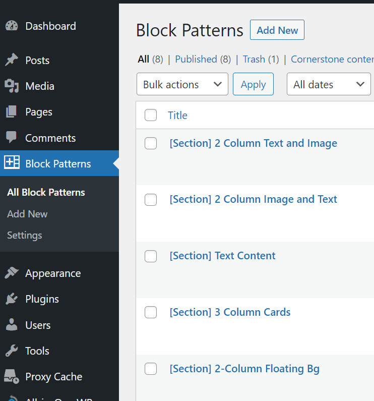
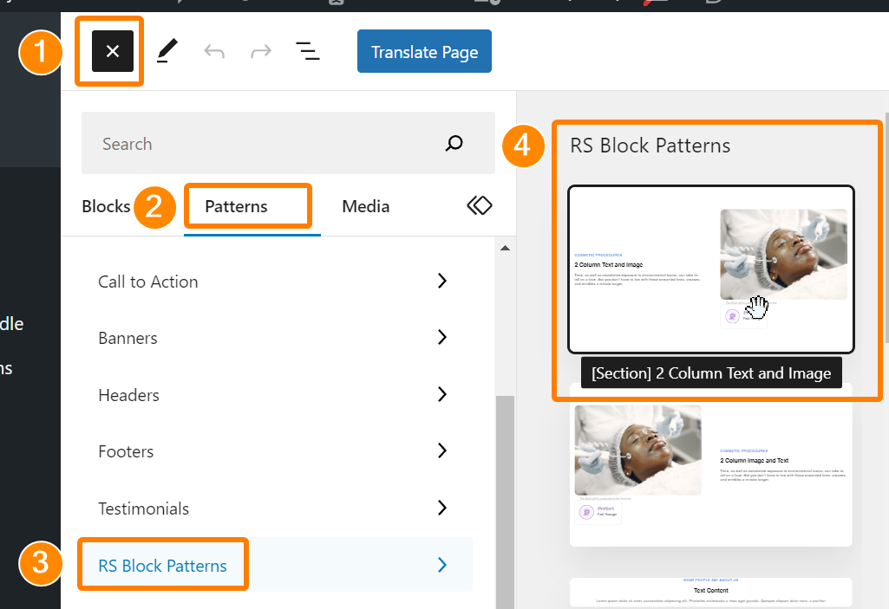
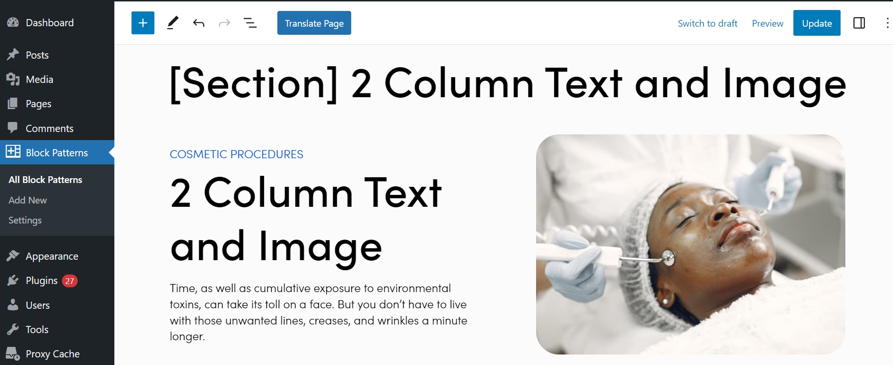

RS Block Patterns (WordPress Plugin)
---

This plugin allows you to create block patterns as a custom post type. They are automatically available as block pattern templates which can be used as blocks in any other post type.

Did you know WordPress already supports [Synced Patterns](https://wordpress.org/documentation/article/reusable-blocks/)? The key difference is that when you add an RS Block Pattern, you're adding the original blocks, without any reusable/synced behavior. This lets you stamp out new templates quickly without worrying about updating a global block by accident.

Requires ACF in order to categorize each block pattern. However, ACF is only required if you want the option to assign your block patterns to multiple categories. By default, all RS Block Patterns are added to a custom pattern category called RS Block Patterns, even without ACF.

    Author: Radley Sustaire
    Author URI: https://radleysustaire.com/
    Contributors: radgh
    Donate link: https://paypal.me/radgh
    Tags: blocks, synced patterns, Gutenberg
    Requires at least: 6.3
    Tested up to: 6.3
    Stable tag: 1.0.0

## Installation ##

1. Upload the plugin zip file through the WordPress plugins screen, or upload the extracted plugin files to `/wp-content/plugins/rs-block-patterns/`.
2. Activate the plugin through the 'Plugins' screen.
3. Use the new "Block Patterns" menu to create new patterns.
4. To add patterns, insert a new block and use the "Patterns" tab on the block sidebar panel.
5. Find your patterns under the "RS Block Patterns" category.

## Frequently Asked Questions ##

**Does this work with full-site editing?**

Probably, but I haven't built an FSE theme and haven't tested it.

**Does this work with Synced Patterns? (formerly Reusable Blocks)**

Yes, it should work with Synced Patterns if you use them within an RS Block Pattern.

## Screenshots ##

Here is the post type screen, showing a few patterns that I created:

Here is the menu to add a new block, shown as a sidebar. The menu has a "Patterns" tab between Blocks and Media. The RS Block Patterns menu contains all of the registered items:

Here is what a block pattern looks like. It will look the same when added to another post type:

## Changelog ##

#### 1.0.0
* First release

## Upgrade Notice ##

None
